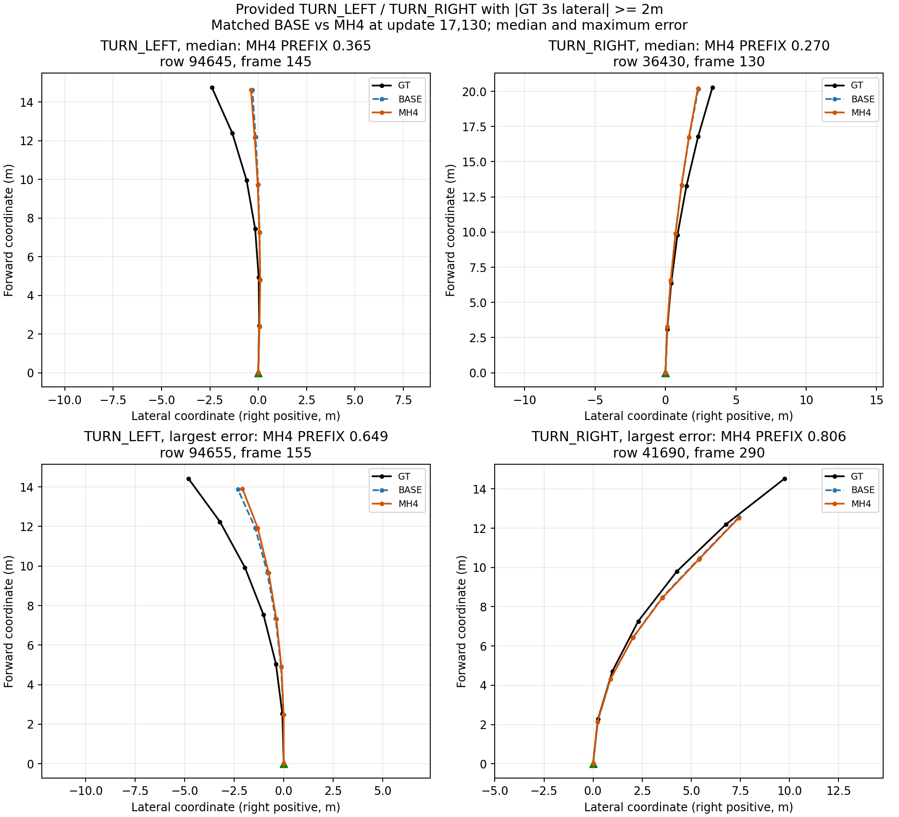
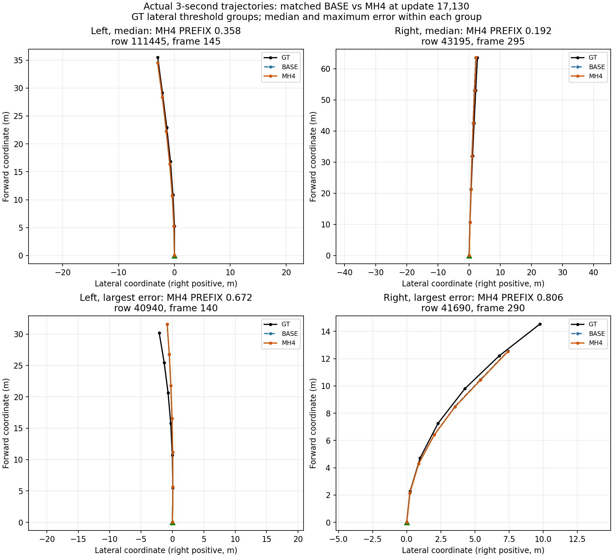

# A2 좌·우회전과 command 가치 분석 — 2026-09-18

저장 예측만 CPU로 분석했다. BASE/MH4는 동일한 **17,130 update / V0 1,998행**을 사용한다.
최종 학습 결과 비교가 아니다. 진행 중인 학습 설정이나 모델 입력은 변경하지 않았다.

## 판단

회전 개선과 제공 command의 대조실험은 가치가 있다. 회전은 전체 오차를 모두 설명하지는 않지만,
특히 좌방향 경로의 횡변위 부족과 검증셋의 희소한 좌회전/U-turn은 놓치면 안 되는 문제다.
현재 주 학습을 완료한 뒤, 같은 입력·예산에서 command를 shared scene query에 추가하는 대조를
작은 다음 후보로 올린다. 새로운 run을 이 분석으로 자동 시작하지 않았다.

기존 보고의 nonstop은 정지하지 않았다는 뜻이다. 직진 전용 그룹이 아니며, 아래 기하학적
좌·우 방향 202행도 모두 nonstop에 포함된다. 따라서 'nonstop이 오차 대부분'이라는 사실로
회전의 우선순위를 낮추는 것은 잘못된 해석이다.

## 현재 goal/command 경로

현재 command/vad_cmd는 모델 입력에 없다. 그러나 goal도 없는 것은 아니다.
5초 goal XY는 scene_encoder.py:142–148에서 BEV cell 위치/goal/cell-goal 상대위치와 함께
공통 scene query를 만든다. planner는 이 goal-conditioned scene을 읽는다.
cross_cell_goal_mode=zero는 별도 cross-cell 분기의 설정이며 기존 per-cell goal을 끄지 않는다.

shared scene은 occupancy/lane/planning이 함께 읽고, planner.forward 입력은
scene_features, motion_features, predicted_state, predicted_history다.
command 실험을 한다면 기존 A2 경계를 유지해 shared scene query의 조건으로 넣는 안을 검토한다.
그 자체로 개별 구조의 운영국 승인을 확인했다는 뜻은 아니다.

코드 근거:
- models/motiondrive_v2/scene_encoder.py:142–148, 180–194
- models/motiondrive_v2/planner.py:31–47
- scripts/motiondrive_v2_data.py:175–176, 394–395
- experiments/md_shared_dynamics_20260917/train_shared_dynamics.py:177–178

## 1. 실제 3초 경로의 모양으로 나눈 결과

이 표는 **GT 3초 끝점의 횡변위 y>=2m / y<=-2m**로 분류한다.
교차로 회전뿐 아니라 굽은 도로와 차선 변경도 포함하므로 아래의 제공 command 라벨과 다르다.
좌표의 +y가 좌측이다. 각 점 오차의 PREFIX 가중치는 [11,11,5,5,2,2]/36이다.

| GT 모양 | 행 | BASE PREFIX | MH4 PREFIX | MH4 전체 점수 기여 |
|---|---:|---:|---:|---:|
| 좌방향 y>=2m | 41 | 0.378873 | 0.375895 | 0.007714 (4.68%) |
| 우방향 y<=-2m | 161 | 0.233264 | 0.235222 | 0.018954 (11.49%) |
| 나머지 | 1,796 | 0.155621 | 0.153787 | 0.138239 (83.83%) |
| 전체 | 1,998 | 0.166459 | 0.164907 | 0.164907 |

MH4의 전체 개선은 이 시점에 주로 나머지 그룹에서 나왔다. 좌방향은 소폭 개선, 우방향은 소폭 악화다.
한 seed의 중간 결과로 통계적 유의성이나 terminal 우열을 주장하지 않는다.

- 큰 좌·우 횡변위 202행에서 예측 끝점이 반대 부호가 된 경우는 0이다.
  그러나 이것이 올바른 회전 경로를 모두 만들었다는 뜻은 아니다.
- GT는 2m 경계를 넘는데 예측은 못 넘은 경우가 좌 14/41, 우 41/161이다.
  경계 근처 사례도 많아 이 55행을 전부 '회전 방향 오선택'으로 세면 안 된다.
- 3초 끝점의 회전 바깥쪽 방향 signed 횡오차 평균: 좌 **-0.8391m**, 우 **-0.3520m**.
  평균적으로 GT보다 횡변위가 작다.
- GT tangent 기준 가중 절대오차: 좌 종 **0.2509m** / 횡 **0.2246m**,
  우 종 **0.1974m** / 횡 **0.0877m**.
  두 투영을 더하면 PREFIX가 되는 것은 아니다.
- 횡변위 부족만으로 회전 시점 지연, 곡률 부족, 진행량 부족의 인과를 확정하지 않는다.

다른 1,796행의 예측을 고정했을 때만 성립하는 산술:
- 좌·우 202행 오류를 절반 줄임: 전체 **0.151573**.
- 좌·우 202행을 완벽하게 맞힘: 전체 **0.138239**.
- 전체 0.15를 이 202행만으로 달성하려면 해당 기여 약 **55.90% 감소** 필요.

이는 후보 모델의 달성 성능이나 command 전체 효과의 상한이 아니다.
command가 회전 준비/진출 구간 등 다른 행도 개선하면 위 가정이 달라진다.

## 2. 제공 semantic command로 나눈 결과

| 제공 command | V0 행 | session 수 | MH4 PREFIX | 전체 점수 기여 |
|---|---:|---:|---:|---:|
| LANE_KEEP | 1,804 | 11 | 0.155929 | 0.140789 |
| TURN_LEFT | 39 | 1 | 0.214593 | 0.004189 |
| TURN_RIGHT | 42 | 3 | 0.287712 | 0.006048 |
| LANE_CHANGE_L | 40 | 4 | 0.286503 | 0.005736 |
| LANE_CHANGE_R | 73 | 5 | 0.222941 | 0.008146 |
| U_TURN | 0 | 0 | — | 0 |

TURN_LEFT/RIGHT는 81행, 전체 점수의 6.21%다. 이 81행만 완벽히 고치면 전체는 0.154670이다.
회전 전후에 아직 횡변위가 작거나 정지한 시점도 해당 command일 수 있다.
첫 표와 이 표의 표본 정의를 섞지 않는다.
특히 TURN_LEFT 39행은 한 session/scene의 연속 샘플이어서 39개의 독립 회전이라고 볼 수 없다.

## 3. 제출 입력의 분포에서 드러나는 검증 사각지대

공식 test 1,125개 command.parquet의 **제공 입력만** 집계했다. 숨겨진 GT나 서버 오차를 읽은 결과가 아니다.

| 제공 command | V0 | Test |
|---|---:|---:|
| LANE_KEEP | 1,804 / 1,998 (90.29%) | 973 / 1,125 (86.49%) |
| TURN_LEFT | 39 (1.95%) | 67 (5.96%) |
| TURN_RIGHT | 42 (2.10%) | 32 (2.84%) |
| U_TURN | 0 | 12 (1.07%) |
| LANE_CHANGE_L | 40 | 21 |
| LANE_CHANGE_R | 73 | 20 |

Test의 제공 vad_cmd는 left31/right110/straight984다.
Semantic command와 vad_cmd가 같은 분류가 아니라는 점도 확인된다.
V0에서 회전 점수 기여가 작다는 이유만으로 실제 제출에서 command 가치가 낮다고 단정할 수 없다.
U-turn은 train310에 375행이 있지만 V0에는 없다. 학습 부재와 검증 부재를 혼동하지 않는다.

## 4. 실제 궤적 그림

GT 검정, BASE 파랑, MH4 주황. 두 모델은 같은 17,130 update다.
가로는 오른쪽이 +인 횡좌표, 세로는 전방 거리다. 원점은 현재 ego 위치다.

제공 TURN_LEFT/RIGHT이면서 실제 3초 횡변위가 2m 이상인 부분에서 각각 MH4 PREFIX 중앙 순위와
최대 오차를 선택했다. 좌회전 두 예시는 같은 scene의 인접 시점이다.
특히 좌측 그림은 GT가 휘기 시작하는 구간에서 예측이 직진 쪽에 가까운 모습을 보인다.
이를 모든 회전의 모습으로 일반화하지 않는다.

두 번째 그림은 semantic command와 무관하게 첫 표의 그룹에서 중앙 순위/최대 오차를 뽑았다.
차선 변경과 굽은 도로가 포함된다. 각 예시 row/scene/좌표는 대응 JSON에 있다.

## 재현·한계

- 코드: experiments/md_a2_nominal_mh4_20260918/analyze_turns.py
- 결과: turn_analysis.json, snapshot_manifest.json
- 입력 snapshot: prediction_snapshot.npz, analysis_metadata.npz (서버 및 로컬 사본 보존)
- 예시: semantic_turn_examples.json/png/pdf, turn_examples.json/png/pdf
- 최초 snapshot은 BASE/MH4가 모두 step17,130일 때 생성했다.
  final_eval.json은 다음 평가 때 바뀌므로 현재 파일과 과거 snapshot을 혼동하지 않는다.
- 기존 A2 terminal 실측-status 결과도 JSON에 별도로 포함했지만 matched 17,130 대조와 혼합하지 않는다.
- command를 실제 입력으로 쓰는 새 학습 전에는 train의 command/vad_cmd 생성 규칙, 제출 parser,
  frame 시점 및 좌우 flip/카메라 기하와의 일치를 확인해야 한다.
- 이 분석은 회전 부족의 원인을 식별하는 intervention 실험이 아니다.
