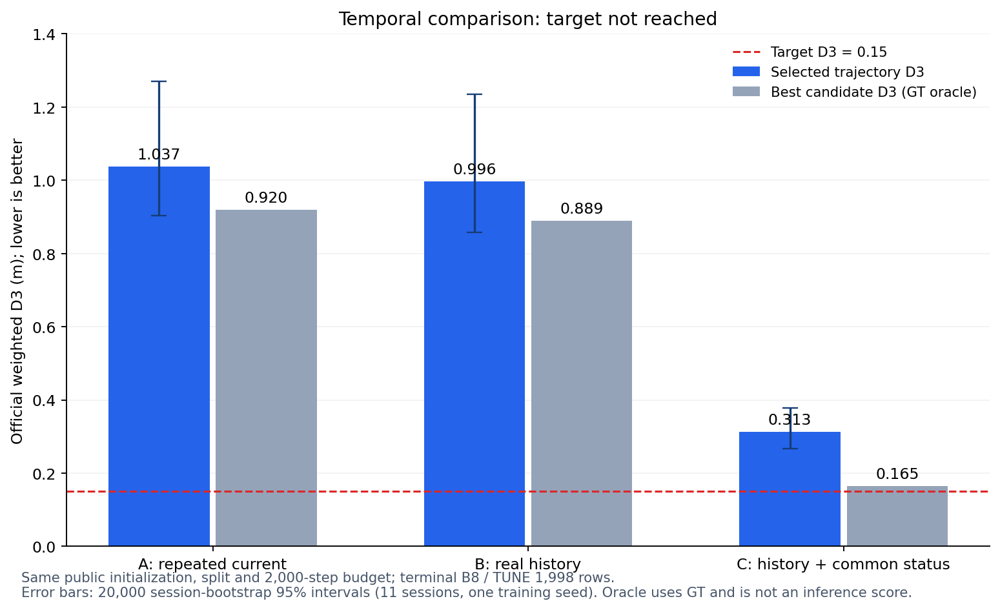

# SparseDriveV2 상태 의존성·시간 영상·공통 인지 검증 결과

2026-09-10. 설정한 진단과 대조 학습, 독립 추론 검증을 완료했다.
**새 대조 모델의 batch1 기준 가장 낮은 D3는 0.313933이며, 목표 0.15에 미달했다.**
기존 0.130749는 실제 pose 유래 status를 planner에 전달하는 별도 모델의
진단 기준이다. 이를 영상 상태 대체 성능이나 규정 승인 결과로 사용하지 않는다.

사용자의 “기존 영상 v0 추정이 충분하지 않았던 것 아닌가”라는 우려는
이번 실험에서 확인됐다. 현재 영상 추정 상태의 단순 교체는 실패했다.
새 구조에서도 과거 영상을 추가한 것만으로 GT급 상태 추정이나 0.15 성능이
확보되지는 않았다. 다음 우선순위는 **속도 후보를 조기에 버리는 과정의 개선**과
**완성 후보별 장면 특징을 사용하는 최종 선택기**다.

## 실제 학습·평가 결과

아래는 각각 terminal2000 체크포인트를 저장된 원본 코드로 새로 불러온
**batch1, 원 TUNE 1,998행 전체** 결과다. GT는 모델 forward 이후 오차 계산에만 썼다.

| 모델 | 입력 차이 | D3 | 후보군 최선 D3 | 선택 regret | 3초 지점 L2 |
|---|---|---:|---:|---:|---:|
| A | 현재 front를 과거 2장 자리에 반복 | 1.042488 | 0.924071 | 0.118417 | 2.459257 |
| B | 실제 과거 front -0.1/-0.5초 | 1.000410 | 0.891080 | 0.109331 | 2.347883 |
| C | B + 공통 영상 인지에 실제 상태 조건 | **0.313933** | **0.164108** | **0.149825** | **0.917727** |

여기서 D3는 0.5초 간격 6개 지점의 Euclidean L2에
`[11,11,5,5,2,2]/36`을 적용한 공식 가중 오차다.
3초 마지막 지점의 L2와 구분한다. Oracle은 GT로 후보 중 최선을 고른
진단값이며 실제 추론 점수가 아니다.

학습 시 정해 둔 batch8 terminal 결과는 A **1.037030**, B **0.996320**,
C **0.313323**이다. 같은 초기화·학습 예산의 비교와 신뢰구간은 이 결과로 계산했다.

- B−A의 D3 차이는 **−0.040709**, paired 95% CI **[−0.088223,+0.012939]**다.
  이번 과거 영상 구현의 단독 개선은 불확실하다.
- C−B는 **−0.682997**, CI **[−0.876525,−0.574046]**다.
  후보 oracle은 0.724802 개선됐으나 선택 regret은 **0.041805 증가**했다.
- C의 영상 전용 상태 보조 head vx MAE는 B **1.365826 → C 2.073799m/s**로
  악화됐다. 이 보조 예측값은 planner 입력으로 사용하지 않는다.
- C−B의 occupancy IoU는 **+0.002011**, lane IoU는 **+0.000543**이다.
  작은 집계 변화에 불과하며 인지 지표의 유의성이나 규정 승인을 입증하지 않는다.

CI는 11개 session을 20,000회 복원추출(seed0)한 frame-weighted paired
percentile 구간이다. 학습 seed 불확실성과 다중 비교는 보정하지 않았다.
Raster 지표는 집계 IoU만 저장돼 session별 CI를 만들지 않았다.
[전체 대조 분석](temporal_analysis_v1/RESULTS_KO.md),
[기계 판독 결과](temporal_analysis_v1/aggregate.json).

## 속도 후보 누락이 남은 주된 병목

C를 batch8로 다시 불러와 모델이 선택한 경로 20개와 속도 10개를 복원했다.
그 뒤 모델과 분리된 GT 진단에서 후보 한 축만 전체 bank로 넓혔다.
모든 좌표는 원래 고정 bank 행이며 6개 시점 모두 유효한 행만 사용했다.

| GT 진단 후보 집합 | 최선 D3 |
|---|---:|
| 현재 경로 20 × 현재 속도 10 | 0.164612 |
| **현재 경로 20 × 전체 속도 1,024** | **0.067896** |
| 전체 경로 1,024 × 현재 속도 10 | 0.152347 |

현재 선택된 경로들에도 좋은 궤적을 만들 수 있는 bank 행이 충분히 있다.
속도 축을 넓힐 때 평균 oracle 이득은 **0.096716**, 경로 축은 **0.012264**다.
따라서 이번 C에서는 속도 후보 포함을 먼저 개선할 근거가 있다.
이 두 이득을 더해 전체 오차를 분해할 수는 없다.

이 실험은 1,024개 속도 후보를 사용하는 실제 신경망의 성능·시간을 측정한
것이 아니다. GT로 최선을 고르는 계산이므로 0.067896을 달성 가능한 제출 점수로
주장하지 않는다. 초기 1,024→64 단계와 이후 64→10 단계 중 어디서 필요한
속도를 버리는지는 후속 설계에서 각각 확인해야 한다.

현재 shortlist를 고정하면 batch1 oracle도 0.164108이므로 **마지막 점수 head만
바꿔 평균 D3≤0.15를 만드는 것은 불가능하다.** 후보 포함 개선과 선택 오차
감소가 모두 필요하다. 이는 shortlist를 바꾸거나 재학습한 모델의 하한이 아니다.
[진단 결과](results/temporal_c_shortlist_v1/result.json),
[행별 oracle·후보 ID](results/temporal_c_shortlist_v1/diagnostics.npz).

## 기존 영상 status를 단순 대체했을 때

원본 모델과 CE head를 고정하고 같은 1,998행에서 입력 위치별로 교란했다.
`base` 개입은 top-k만이 아니라 base 전체의 상태 조건·후보 토큰·기본 점수를
함께 바꾼다. 마지막 head만 바꾸는 개입에서는 후보 집합이 고정된다.

| 조건 | D3 | 후보군 최선 D3 |
|---|---:|---:|
| 원본 실제 status | 0.130749 | 0.090494 |
| P7 영상 status를 base에만 치환 | 1.137415 | 1.112857 |
| P7 영상 status를 마지막 head에만 치환 | 0.243276 | 0.090494 |
| P7 영상 status를 양쪽에 치환 | **1.170503** | **1.112857** |
| vx bias −0.1m/s, 양쪽 | 0.157206 | 0.102185 |
| vx bias +0.1m/s, 양쪽 | 0.160285 | 0.096295 |

P7 치환값은 저장된 실제 영상 예측의 first4를 그대로 사용했다.
GT residual 보정은 하지 않았다. 양쪽 치환에서 원래 200개 후보 중 평균
**17.58개**만 남았다. P7의 tune vx MAE는 약 **0.984m/s**이며 세션·시간
상관 오차도 확인됐다. 작은 독립 백색 잡음만 적용해 판단하지 않았다.

P7 양쪽 치환의 ΔD3는 **+1.03975**, paired CI **[+0.83495,+1.20652]**다.
원본과 3 GPU shard의 baseline 예측·ID는 byte 단위로 일치했다.
Signed bias, 신호 제거, session/시간 상관 잡음, 실제 P7 상태의 24조건을
위치별로 비교했다. [전체 결과와 민감도 그래프](analysis_v3/RESULTS_KO.md).

vx ±0.05m/s의 D3는 0.1364/0.1396, ±0.1m/s는 0.1572/0.1603이었다.
이것은 동결 모델의 측정점이며 모든 영상 모델에 적용할 MAE 임계치가 아니다.
상태 0 입력에서의 붕괴도 재학습 성능의 상한으로 해석하지 않는다.
[오차 정의·원본 P7 provenance](empirical/EMPIRICAL_STATUS_KO.md).

종방향 문제라는 해석도 실제 XY 오차로 확인했다. 원본의 가중 평균
`|ex|/|ey|`는 **0.109314/0.046292m**, P7 양쪽 치환은
**1.161927/0.066217m**다. 전체 6시점의 종방향 제곱오차 에너지 비율은
**78.745% → 99.154%**다. 이것은 D3의 가산 기여율이나 확률이 아니다.
[시점별 축 오차](axis_errors_frozen_v1/AXIS_ERRORS_KO.md).

## 새 모델의 가중치와 실제 입력 경계

새 모델은 공개 **SparseDriveV2 NAVSIMv1** 가중치를 사용했다.
ResNet34/FPN과 path·velocity·trajectory decoder 등을 재사용하며,
temporal fusion·공간 occupancy/lane 보조·최종 선택 모듈은 새로 학습했다.
공개 checkpoint에 정밀한 영상 속도 추정기나 해당 인지 head가 이미 들어
있었다고 주장하지 않는다.

- 공개 source: `swc-17/SparseDriveV2@696ef77924eb9e0a4b4047d013a50e9854bfa026`.
- 공개 weight: `wenchaosun/SparseDriveV2/sparsedrive_navsimv1_92p2.ckpt`,
  revision `42c15531aa6cb18c7360dd0377cfc1c221280597`.
- SHA256: `330072b133981f77b0b18b669216ad50b211552a82ea45ac52d507ec9021a735`.
- 초기 로드에서 공개 학습 파라미터 **41,808,827개**, 새 파라미터 **562,055개**.
  로드한 수와 현재 loss/입력에서 활성인 파라미터 수는 같은 개념이 아니다.
  예를 들어 원 status encoding의 weight는 로드해도 입력이 항상 0이다.
- Bank는 원 TRAIN203에서 만든 P1024×V1024 고정 bank를 유지했다.

현재 카메라는 **front-left/front/front-right**다. 과거 입력은 정면
−1/−5 frame이며 nominal −0.1/−0.5초다. 모든 arm의 모델 연산은 현재
3장+과거 자리 2장으로 같다. A는 비교를 위해 현재 front를 반복한다.
이 실험이 6카메라나 더 긴 history의 필요성을 판정한 것은 아니다.

실제 경계는 다음과 같다.

1. A/B는 영상·고정 calibration·time offset만 temporal perception에 넣는다.
2. C만 과거 pose −10…0의 nominal quadratic fit에서 얻은 `vx,vy,ax,ay`를
   공통 영상 attention query의 조건으로 넣는다. Values는 영상 특징이다.
   결과 특징은 현재 occupancy/lane과 planning이 함께 사용한다.
3. 원 public planner와 relative head의 직접 status는 항상 새로 만든 0이다.
   영상 상태 보조 예측은 loss/진단에만 사용한다.
4. Goal은 모델이 완성한 bank 후보의 최종 점수 계산에만 쓴다.
   과거 pose로 영상을 warp하지 않으며 goal을 planner query에 넣지 않는다.

`OPEN_ISSUE.md` Q7/Q8/Q10을 반영한 경계다. 옛 `GoalConditionedSelector`는
이름과 달리 goal을 planner 상태 encoding에 주입하므로 새 모델에서 사용하지 않는다.
C는 공통 인지의 간접 활용을 시험한 구조이며 주최 측의 사전 승인 결과가 아니다.
작은 인지 지표 변화만으로 큰 계획 개선을 모두 인지 개선 때문이라고 단정할
수 없으므로 **이번 C를 규정 심사를 통과할 제출 후보로 확정하지 않는다.**
추가 semantic-output-only 경계를 규정의 의무 조건으로 부과한 것도 아니다.
[코드·규정 검토](architecture_review.md).

## 재현성, 데이터 누출, 추론 비용

TRAIN203/TUNE37는 다시 나누지 않았다. 학습은 54,810행/72 session,
평가는 1,998행/11 session이며 서로 session이 겹치지 않는다.
Bank fitting과 학습은 원 train만 사용했고 reserve136은 사용하지 않았다.
과거 confirmation12의 32개 scene은 원 TRAIN203에 속하므로 이번 학습에
모두 포함됐다. 이 집합을 새 모델의 독립 확인 집합으로 재사용할 수 없다.
[과거 confirmation과의 교집합](HISTORICAL_CONFIRMATION_OVERLAP.json).
TUNE는 과거부터 반복 사용된 탐색 집합으로, 이번 결과가 독립 최종 확인은 아니다.

세 arm은 같은 source/public/bank/파라미터 수·초기화·증강·seed·2,000 step,
batch16 예산이다. 초기 planning 배열은 byte 단위로 같았고,
기록된 201개 step의 batch row SHA·LR·epoch·유효 label 수가 같았다.
기록되지 않은 나머지 모든 batch를 사후 직접 증명한 것으로 표현하지 않는다.
학습은 각 GPU에서 약 31분이 걸렸고 세 실행 모두 exit0이다.
정해진 terminal을 평가했으며 중간 best checkpoint를 고르지 않았다.
[학습 규약](STATUS_REDESIGN_PROTOCOL.md), [분석 실행 방법](TEMPORAL_ANALYSIS_HANDOFF.md).

독립 batch1 평가에서 1,998행 모두 직접 status=0, 고정 bank 좌표·유효 후보
선택을 관측했다. Batch8→batch1에서는 선택 ID가 A 741/B 670/C 982행에서
달라졌다. 단순 FP64 집계 차이만이 아니다. D3 차이는 각각
+0.005458/+0.004090/+0.000610으로 작았으나 sample별 예측 동일성을 주장하지 않는다.
C를 다시 **같은 batch8**로 실행한 1,998행의 예측·ID·행 순서는 원 terminal과
완전히 같았다. Batch 크기에 따른 수치·선택 민감성을 실제 출력과 함께 보존했다.

원본 JPEG/parquet로 만든 실제 tune row14730에서 A/B/C 모두 캐시 입력과
모델의 후보·점수·인지 보조·최종 궤적이 byte 단위로 같았다. Goal을 바꿔도
upstream 후보와 인지 출력은 그대로였고, C의 raw 상태를 바꿔도 영상 전용
state auxiliary는 변하지 않았다. 단일 실제 행의 parity를 모든 환경에
대한 bitwise 보장으로 확대하지 않는다.
원본 입력 adapter는 GT·학습 cache를 읽지 않는다. 검증기의 별도 캐시 비교
로더는 외부 GT label을 materialize하지만 이를 모델 입력이나 parity 판단에 쓰지 않는다.
Fixture builder는 제공된 +50점의 RPY도 읽고 NaN으로 바꾸므로 해당 값에 대해
“미열람”이라고 표현하지 않는다. Adapter는 미래 RPY를 수치 계산에 사용하지 않는다.
[원본 입력 재현 방법](TEMPORAL_RAW_VERIFICATION_HANDOFF.md).

| 모델 | B200 전체 forward 평균 / p95 | 별도 raw 검증의 CPU 전처리 평균 |
|---|---:|---:|
| A | 20.078 / 23.015ms | 93.136ms |
| B | 20.272 / 21.327ms | 118.447ms |
| C | 22.041 / 29.639ms | 136.224ms |

Forward 시간은 warmup10+50회, B1 한 입력을 반복한 값이다.
현재·과거 인코딩, 인지 보조 head, base decoder와 최종 goal selector를 모두
포함한다. Raw decode/I/O/전처리/H2D/GT metric/평가용 hook은 제외했다.
CPU 전처리는 원본 읽기·왜곡 보정·crop/JPEG95·resize/정규화·허용된 상태/goal
조립을 포함한 별도 측정(warm2+10회, OpenCV1 thread, camera workers3)이다.
세 독립 job이 같은 host에서 진행됐고 OS cache가 warm일 수 있다.
두 수치를 합쳐 정식 end-to-end latency라고 주장하지 않는다.
**RTX4090과 공식 FLOPs cut-off는 측정하지 않았으며 공식 Error Score·심사 통과를
이 B200 수치로 환산하지 않는다.**

## 다음 설계 결정

1. **속도 후보 포함 개선이 먼저다.** 현재 public decoder의 1024→64→10
   각 단계에서 필요한 속도가 탈락하는 비율을 나누어 보고, 마지막 후보 수
   10→32/64 변경과 앞단 velocity score 학습을 작은 대조로 검증한다.
   먼저 oracle을 충분히 낮춰 최종 선택 오차가 들어갈 여지를 확보해야 한다.
   전체 1,024개로 확장한 GT 진단을 그대로 배포하는 안은 아니다.
2. **완성 후보별 256D 장면 특징을 final selector에 제공한다.** 현재 final head가
   받는 연속 scene 정보는 기본 scalar logit에 압축된다. 원 decoder의
   `traj[B,K,256]`를 완료 후보와 함께 전달해 goal과 점수만 계산한다.
   같은 frozen base·후보·행·예산에서 실제 token과 zero-token을 같은 크기의
   head로 비교하고, loss까지 동시에 바꾸지 않는다. 원시/예측 status를
   final head에 추가하지 않는다. C의 token에는 공통 인지 상태 조건의
   간접 영향이 있으므로 “순수 영상 token”이라고 부르지 않는다.
3. **인지 효과와 일반화는 따로 검증한다.** C의 common perception 인지 유용성을
   검증하고 계획 개선의 재현성을 확인하며, 선택한 설계를 고정한 뒤 추가 seed·독립 확인과
   RTX4090 비용을 평가한다. 이번 결과를 위해 TRAIN/VAL을 재분할하지 않는다.

이것은 다음 실험의 근거와 순서다. 아직 실행하지 않은 새 구조의 0.15 성능을
약속하지 않는다. 현재 완료한 2,000-step 대조는 GT급 영상 상태 추정 가정을
채택하지 않을 근거와 속도 축의 후보 누락을 확인했으며, 구조 전체의
도달 가능한 최저 오차를 입증한 것은 아니다.

## 보존된 산출물

원격 worktree는
`/NHNHOME/data/sukim/adcl/experiment_worktrees/sparsedrivev2_20260910`,
브랜치는 `codex/sparsedrivev2-status-20260910`이다.

- 진단 코드 commit `63c220a`, 대조 학습 코드 `2319076`,
  평가·원본 입력 감사 코드 `08a4ee1`.
- 원격 checkpoint: `work_dirs/sparsedrivev2_status_20260910/temporal_{a_repeat,b_history,c_common}_s0_v1/last.pth`.
- C checkpoint SHA256:
  `b9dcc56af7c2c4c3cfc80d844fe862a2d8f730d7b8d7a813ee997d33abfec2ff`.
- 실행 종료 상태: [launch receipts](results/launches/temporal_c_shortlist_v1.json).
- 기존 두 체크포인트의 원 SHA 보존:
  [preservation receipt](results/original_checkpoint_preservation.json).
- B1 결과 및 입력 경계: [A](results/temporal_a_b1_v1/receipt.json),
  [B](results/temporal_b_b1_v1/receipt.json), [C](results/temporal_c_b1_v1/receipt.json).
- 원본 모델 입출력 parity: [A](results/temporal_a_raw_v1/receipt.json),
  [B](results/temporal_b_raw_v1/receipt.json), [C](results/temporal_c_raw_v1/receipt.json).

기존 모델·분할을 덮어쓰거나 외부 제출을 하지 않았다.
